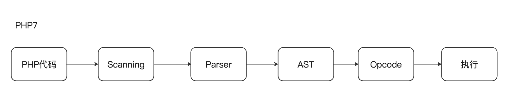

## PHP7与PHP5有什么区别

## 1. 抽象语法树


php5执行流程，大概如下：

- 1.Scanning(Lexing) ,将PHP代码转换为语言片段(Tokens)
- 2.Parsing, 将Tokens转换成简单而有意义的表达式
- 3.Compilation, 将表达式编译成Opcodes
- 4.Execution, 顺次执行Opcodes，每次一条，从而实现PHP脚本的功能。

用通俗的话来说就是，首先通过对php的代码进行词法分析，然后得到了一个个词，然后在parsing阶段，将之前得到的词中无用的词给去处掉，留下有意义的表达式，接着，将上一步的有意义的表达式，编译成opcodes,最后依次执行opcodes字段，从而实现PHP脚本。



对于php7来说，增加了抽象语法树，也就是在Parsing到Compilation之间，将php代码解析生成抽象语法树，然后将抽象语法树编译为opcodes，从而将php的编译器与执行器很好的隔离开，同时加快了速度

## 2、Native TLS（Native Thread local storage，原生线程本地存储）
 
>注：因为线程是共享进程的内存空间的，所以每个线程本身需要通过某种方式，构建私有的空间来保存自己的私有数据，避免和其他线程相互污染。
     
PHP在多线程模式下，需要解决“线程安全”（TS，Thread Safe）的问题，PHP5采用的方式，就是 **维护一个全局大数组，为每一个线程分配一份独立的存储空间**，线程通过各自拥有的key值来访问这个全局数据组。而这个独有的key值在PHP5中需要传递给每一个需要用到全局变量的函数，PHP7认为这种传递的方式并不友好，并且存在一些问题。
因而，尝试采用一个 **全局的线程特定变量** 来保存这个key值。
 
相关的Native TLS问题：https://wiki.php.net/rfc/native-tls

## 3、标量类型/返回值类型声明
PHP语言一个非常重要的特点就是“弱类型”，它让PHP的程序变得非常容易编写.PHP7引入了一个开关指令declare(strict_type=1);，当这个指令一旦开启，将会强制当前文件下的程序遵循严格的函数传参类型和返回类型。

例子:
```php
<?php
/**
 * 本例子表明入参为多个数组，出参为数组
* @param array ...$arrays
 * @return array
 */
function arraysSum(array ...$arrays): array
{
 return array_map(function(array $array): int {
     return array_sum($array);
     }, $arrays);
}

```

## 4、异常处理
php5中的`try{}catch(){}`无法处理传统错误,如果有需要会考虑用`set_error_handler`，但是也有一些错误类型是其捕获不到的，

`\Exception` 是所有PHP及用户异常的基类；`\Error` 是所有内部PHP错误的基类。
PHP 7引入`Throwable` 接口，让错误及异常都实现了 Throwable。
存在无法直接实现 Throwable的，都可以扩展` \Exception` 和 `\Error` 类，这样就可以用 `Throwable` 捕捉异常跟错误。

例子
```php
<?php

$name = 'exception';

try{
    
}catch (\Throwable $exception){
    print_r($exception->getMessage());die();
}
```

## 5、zval结构的变化
php7将引用计数(refcount_gc)转移到了具体的value中，避免复制变量时需要复制两个结构，使php变量之间的复制、传递更加简洁、易懂，zval结构的大小也从24byte减少到了16byte

参考链接：
https://www.laruence.com/2018/04/08/3170.html

## 6. HashTable的变化
HashTable结构的大小从72byte减小到了56byte, 数组元素Bucket结构也从72byte减小到了32byte

参考链接：https://www.laruence.com/2020/02/25/3182.html

## 7. 执行器
执行器的调度函数为execute_ex(), 这个函数负责执行php代码编译生成的ZendVM执行.

执行期间会频繁的用到execute_data、opline两个变量，之前版本中，这两个变量是由execute_ex()通过参数传递给各指令handler的，php7改为用寄存器存储这两个变量，避免了传参导致的频繁的出入栈操作，同时寄存器访问速度更快，这个优化使得php的性能有了5%左右的提升
