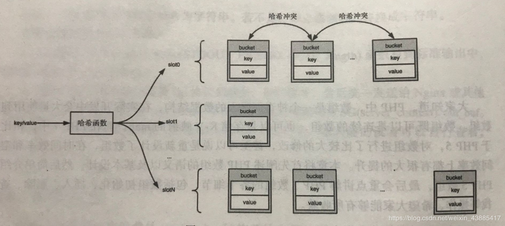
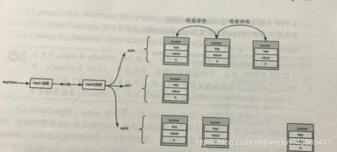
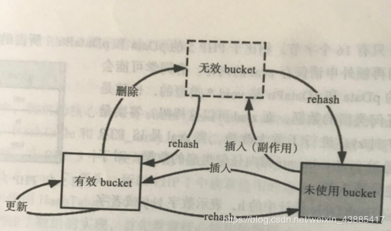

# php_array底层实现原理

> 简介回答：php5数组是由哈希表+链表实现，准确来说，是由哈希表+双向链表实现
----------------
## 一、数组的语义
本质上，PHP数组是一个有序的字典，它需要同时满足一下两个语义。
- 语义一：PHP数组是一个字典，存储着键—值（key—value）对。通过键可以快速地找到对应的值，键可以是整形，也可以是字符串。
- 语义二：PHP数组是有序的。这个有序是指插入顺序，遍历数组的时候，遍历元素的顺序应该和插入顺序一致，而不像普通字典一样是随机的。

为了实现语义一，PHP用HashTable来存储键—值对，但是HashTable本身并不能保证语义二，PHP不同版本都对HashTable进行了额外的设计来保证有序，下面会进行介绍。

## 二、数组的概念



- key: 键，通过它可以快速检索到对应的value。一般为数字或字符串。
- value : 值，目标数据。可以是复杂的数据结构。
- bucket： 桶，HashTable中存储数据的单元。用来存储key和value以及辅助信息的容器。
- slot: 槽，HashTable有多个槽，一个bucket必须从属于具体的某一个slot，一个slot下可以有多个bucket。
- 哈希函数： 需要自己实现，在存储的时候，会对key应用哈希函数确定所在slot。
- 哈希冲突：当多个key经过哈希计算后，得出的slot的位置是同一个，那么就叫作哈希冲突。一般解决冲突的方法是链地址法和开放地址法。PHP采用链地址法，将同一个slot中的bucket通过链表链接起来。

在具体实现中，PHP基于上述基本概念对bucket以及哈希函数进行了一些补充，增加了hash1函数以生成h值，然后通过hash2函数散列到不同的slot。



**注意:中间h值的作用**：

1、HashTable中key可能是数字，也可能是字符串，所以bucket在设计key的时候，需要做拆分，拆分数字key和字符串key，在上图bucket中，“h” 代表数字key, “”key“ 代表字符串key。实际上，对于数字key，hash1不做任何处理。

2、每个字符串都有一个h值，这个h值可以加快字符串的比较速度，当比较两个字符串是否相等，先比较key1和key2的h值是否相等，如果相等，再去比较字符串的长度以及内容。否则直接判定不相等。

## 二、PHP5数组的实现

首先、PHP5的bucket以及HashTable结构定义：
````php
typedef struct bucket {  
    ulong h;                   /* 4字节 对char *key进行hash后的值，或者是用户指定的数字索引值/* Used for numeric indexing */
    uint nKeyLength;           /* 4字节 字符串索引长度，如果是数字索引，则值为0 */  
    void *pData;               /* 4字节 实际数据的存储地址，指向value，一般是用户数据的副本，如果是指针数据，则指向pDataPtr,这里又是个指针，zval存放在别的地方*/
    void *pDataPtr;            /* 4字节 引用数据的存储地址，如果是指针数据，此值会指向真正的value，同时上面pData会指向此值 */  
    struct bucket *pListNext;  /* 4字节 整个哈希表的该元素的下一个元素*/  
    struct bucket *pListLast;  /* 4字节 整个哈希表的该元素的上一个元素*/  
    struct bucket *pNext;      /* 4字节 同一个槽，双向链表的下一个元素的地址 */  
    struct bucket *pLast;      /* 4字节 同一个槽，双向链表的上一个元素的地址*/  
    char arKey[1];             /* 1字节 保存当前值所对于的key字符串，这个字段只能定义在最后，实现变长结构体*/  
} Bucket;

````
####（1）这里bucket新增三个元素:
```text
arkey： 对应HashTable设计中的key,表示字符串key。
h: 对应HashTable设计中的h,表示数字key或者字符串key的h值。
pData和pDataPtr: 对应HashTable设计中的value。
```
一般value存储在pData所指向的内存，pDataPtr是NULL，但如果value的大小等于一个指针的大小，那么不会再额外申请内存存储，而是直接存储在pDataPtr上，再让pData指向pDataPtr，可以减少内存碎片。

####（2）为了实现数组的两个语义，
bucket里面有pListLast、pListNext、pLast、pNext这4个指针，维护两种双向链表。

一种是全局链表，按插入顺序将所有bucket全部串联起来，整个HashTable只有一个全局链表。

另一个是局部链表，为了解决哈希冲突，每个slot维护着一个链表，将所有哈希冲突的bucket串联起来。

总结:每一个bucket都处在一个双向链表上。pLast和pNext分别指向局部链表的前一个和后一个bucket，pListLast和pListTNext则指向全部链表的前一个和后一个。

```c
typedef struct _hashtable {  
    uint nTableSize;           /*4 哈希表中Bucket的槽的数量，初始值为8，每次resize时以2倍速度增长*/
    uint nTableMask;           /*4 nTableSize-1 ，索引取值的优化 */
    uint nNumOfElements;       /*4 哈希表中Bucket中当前存在的元素个数，count()函数会直接返回此值*/
    ulong nNextFreeElement;    /*4 下一个数字索引的位置 */
    Bucket *pInternalPointer;  /*4 当前遍历的指针（foreach比for快的原因之一） 用于元素遍历*/
    Bucket *pListHead;         /*4 存储数组头元素指针 */
    Bucket *pListTail;         /*4 存储数组尾元素指针 */
    Bucket **arBuckets;        /*4 指针数组,数组中每个元素都是指针,存储hash数组 */
    dtor_func_t pDestructor;   /*4 在删除元素时执行的回调函数，用于资源的释放 /* persistent 指出了Bucket内存分配的方式。如果persisient为TRUE，则使用操作系统本身的内存分配函数为Bucket分配内存，否则使用PHP的内存分配函数。*/
    zend_bool persistent;      /*1 */
    unsigned char nApplyCount; /*1 标记当前hash Bucket被递归访问的次数（防止多次递归）*/
    zend_bool bApplyProtection;/*1 标记当前hash桶允许不允许多次访问，不允许时，最多只能递归3次 */
#if ZEND_DEBUG  
    int inconsistent;          /*4 */ 
#endif  
} HashTable; 
```

PHP7为什么要重写数组实现?
- 1、每一个bucket都需要一次内存分配。
- 2、key—value中的value都是zval。这种情况下，每个bucket需要维护指向zval的指针pDataPtr以及指向pDataPtr的指针pData。
- 3、为了保证数组的两个语义，每一个bucket需要维护4个指向bucket的指针。
以上原因，导致性能不好。

## 三、PHP7数组实现

PHP7也是通过链地址法，但是此 “链” 非彼 “链”。PHP5的链表是在物理上得到链表，链表中bucket之间的上下游关系通过真实存在的指针来维护。

而PHP7的链表是一种逻辑上的链表，所有bucket都分配在连续的数组内存中，不再通过指针来维护上下游关系，每一个bucket只维护下一个bucket在数组中的索引（因为是连续内存，通过索引可以快速定位到bucket），即可完成链表上的bucket的遍历。

```text
typedef struct _Bucket {
    zval              val;      /* 对应HashTable设计中的value */ 
    zend_ulong        h;        /* 对应HashTable设计中的h，表示数字key或者字符串key的h值。*/        
    zend_string      *key;      /* 对应HashTable设计中的key */          
} Bucket;
```

bucket可以分为3种：未使用、有效、无效。
- 未使用：最初所有bucket都是未使用状态。
- 有效：存储着有效的数据。
- 无效：当bucket上的数据被删除时，有效bucket就会变为无效bucket。

在内存分布上，有效和无效bucket会交替分布。但都在未使用bucket的前面。插入的时候永远在未使用bucket上进行，当无效bucket过多，而有效bucekt很少时，对整个bucket数组进行rehash操作这样稀疏的有效bucket就变得连续而紧密，部分无效bucket会被重新利用而变得有效，还有一部分有效bucket和无效bucket会被释放出来，重新变为未使用bucket。



```text
struct _zend_array { 
    zend_refcounted_h  gc;
    union {
        struct {
            ZEND_ENDIAN_LOHI_4(
                zend_uchar    flags,
                zend_uchar    nApplyCount,  /* 循环遍历保护 */
                zend_uchar    nInteratorsCount,
                zend_uchar    consistency)
        } v;
        uint32_t flags;
    } u;
    uint32_t          nTableMask;           /* 掩码,用于根据hash值计算存储位置,永远等于nTableSize-1 */
    Bucket           *arData;               /* 存放实际数据 */
    uint32_t          nNumUsed;             /* arData数组已经使用的数量 */
    uint32_t          nNumOfElements;       /* hash表中元素个数 */
    uint32_t          nTableSize;           /* hash表的大小 HashTable的大小，始终为2的指数（8,16,32,64...）。最小为8，最大值根据机器不同而不同*/
    uint32_t          nInternalPointer;     /* 用于HashTable遍历 */
    zend_long         nNextFreeElement;     /* 下一个空闲可用位置的数字索引 */
    dtor_func_t       pDestructor;          /* 析构函数 */
} HashTable;
```

参考资料：
- https://blog.csdn.net/weixin_43885417/article/details/101118471
- https://blog.csdn.net/weixin_34362875/article/details/91465117
- https://github.com/pangudashu/php7-internal/blob/master/2/zend_ht.md
- https://segmentfault.com/a/1190000018720188
