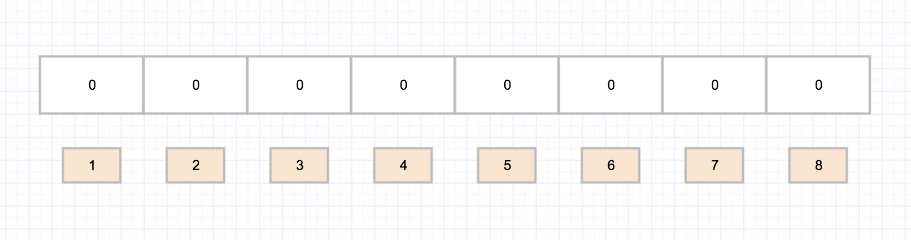

# 什么是布隆过滤器？

## 一、定义
本质上 布隆过滤器是一种数据结构，比较巧妙的概率型数据结构，特点是高效的插入和查询可以用来告诉你 “某样东西一定不存在或者可能存在”。

## 二、实现原理

**布隆过滤器数据结构：**

布隆过滤器是一个bit向量或者bit数组,长这样：

## 支持删除么
传统的布隆过滤器并不支持删除操作。但是名为 Counting Bloom filter 的变种可以用来测试元素计数个数是否绝对小于某个阈值，它支持元素删除，可参考下面资料

cbf介绍:https://cloud.tencent.com/developer/article/1136056

##如何选择哈希函数个数和布隆过滤器长度
很显然，过小的布隆过滤器很快所有的 bit 位均为 1，那么查询任何值都会返回“可能存在”，起不到过滤的目的了。布隆过滤器的长度会直接影响误报率，布隆过滤器越长其误报率越小。

另外，哈希函数的个数也需要权衡，个数越多则布隆过滤器 bit 位置位 1 的速度越快，且布隆过滤器的效率越低；但是如果太少的话，那我们的误报率会变高。

## 最佳实践
常见的适用常见有，利用布隆过滤器减少磁盘 IO 或者网络请求，因为一旦一个值必定不存在的话，我们可以不用进行后续昂贵的查询请求。

另外，既然你使用布隆过滤器来加速查找和判断是否存在，那么性能很低的哈希函数不是个好选择，推荐 MurmurHash、Fnv 这些。

## 大Value拆分
Redis 因其支持 setbit 和 getbit 操作，且纯内存性能高等特点，因此天然就可以作为布隆过滤器来使用。但是布隆过滤器的不当使用极易产生大 Value，增加 Redis 阻塞风险，因此生成环境中建议对体积庞大的布隆过滤器进行拆分。

拆分的形式方法多种多样，但是本质是不要将 Hash(Key) 之后的请求分散在多个节点的多个小 bitmap 上，而是应该拆分成多个小 bitmap 之后，对一个 Key 的所有哈希函数都落在这一个小 bitmap 上。

参考资料：https://zhuanlan.zhihu.com/p/43263751

